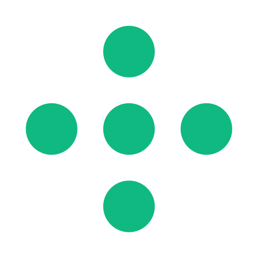
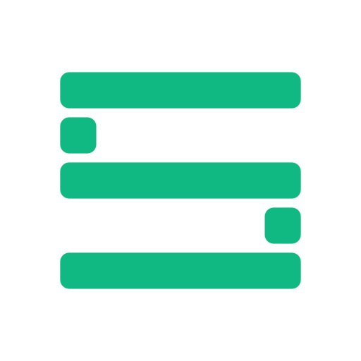
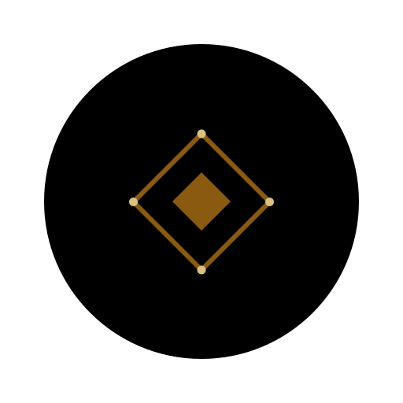

# Sentrix Labs — Brand Kit

Official brand assets for **SentrisCloud** (company), **Sentrix Labs** (protocol foundation), and **Sentrix Chain** — an Indonesian Layer 1 Blockchain built in Rust.

<p align="center">
  
  
  
</p>

<p align="center">
  <a href="https://sentrixchain.com"></a>
  <a href="BRAND_GUIDE.md"></a>
  <a href="USAGE.md"></a>
  <a href="LICENSE"></a>
</p>

---

## About

**Sentrix Chain** is the L1 blockchain developed by Sentrix Labs. This repository contains all official brand assets — logos, icons, banners, and guidelines — for use in exchange listings, integrations, editorial coverage, and ecosystem projects.

For the full brand guide, see [`BRAND_GUIDE.md`](BRAND_GUIDE.md).

**For practical "which file should I use here?" guidance — read [`USAGE.md`](USAGE.md) first.** It maps every Sentrix Chain surface (nav, footer, favicon, exchange listing, social avatar) to the specific asset and gives the canonical wordmark pairing rules.

---

## Quick Links

### Sentrix Chain (product)

| Asset | Path |
|-------|------|
| SVG master (full, with circle) | [`svg/sentrix-logo-full.svg`](svg/sentrix-logo-full.svg) |
| SVG transparent (no circle) | [`svg/sentrix-logo-transparent.svg`](svg/sentrix-logo-transparent.svg) |
| SVG monochrome black | [`svg/sentrix-logo-mono-black.svg`](svg/sentrix-logo-mono-black.svg) |
| SVG monochrome white | [`svg/sentrix-logo-mono-white.svg`](svg/sentrix-logo-mono-white.svg) |
| Favicon set | [`favicon/`](favicon/) |
| Exchange listing icons | [`exchange/`](exchange/) |
| Social media kit | [`social/`](social/) |
| **Profile picture variants** | [`avatars/`](avatars/) |
| App store icons | [`app-icon/`](app-icon/) |

### SentrisCloud (company)

| Asset | Path |
|-------|------|
| SVG primary (emerald) | [`svg/sentriscloud-mark.svg`](svg/sentriscloud-mark.svg) |
| SVG monochrome black | [`svg/sentriscloud-mark-mono-black.svg`](svg/sentriscloud-mark-mono-black.svg) |
| SVG monochrome white | [`svg/sentriscloud-mark-mono-white.svg`](svg/sentriscloud-mark-mono-white.svg) |
| Raster (transparent) | [`png-transparent/sentriscloud-512.png`](png-transparent/sentriscloud-512.png) |
| Mono raster | [`mono/`](mono/) (`sentriscloud-black-*`, `sentriscloud-white-*`) |
| GitHub org avatar | [`social/sentriscloud-github-500.png`](social/sentriscloud-github-500.png) |

### Sentrix Labs (protocol foundation)

| Asset | Path |
|-------|------|
| SVG primary (emerald) | [`svg/sentrix-labs-mark.svg`](svg/sentrix-labs-mark.svg) |
| SVG monochrome black | [`svg/sentrix-labs-mark-mono-black.svg`](svg/sentrix-labs-mark-mono-black.svg) |
| SVG monochrome white | [`svg/sentrix-labs-mark-mono-white.svg`](svg/sentrix-labs-mark-mono-white.svg) |
| Raster (transparent) | [`png-transparent/sentrix-labs-512.png`](png-transparent/sentrix-labs-512.png) |
| Mono raster | [`mono/`](mono/) (`sentrix-labs-black-*`, `sentrix-labs-white-*`) |
| GitHub org avatar | [`social/labs-github-500.png`](social/labs-github-500.png) |

| | |
|-------|------|
| **Full Brand Guide** | [`BRAND_GUIDE.md`](BRAND_GUIDE.md) |

---

## CDN Usage

Use **jsDelivr** for fast, globally-cached delivery (recommended for exchange listings & integrations):

```
https://cdn.jsdelivr.net/gh/sentrix-labs/brand-kit@master/png-transparent/sentrix-256.png
https://cdn.jsdelivr.net/gh/sentrix-labs/brand-kit@master/exchange/coingecko-200.png
https://cdn.jsdelivr.net/gh/sentrix-labs/brand-kit@master/svg/sentrix-logo-full.svg
```

Alternatively, GitHub raw URLs:

```
https://raw.githubusercontent.com/sentrix-labs/brand-kit/master/png-transparent/sentrix-256.png
```

---

## Color Palette

### Sentrix Chain

| Name | Hex | RGB |
|------|-----|-----|
| Sentrix Black | `#000000` | 0, 0, 0 |
| Sentrix Bronze | `#8A5A11` | 138, 90, 17 |
| Sentrix Gold | `#DBC17F` | 219, 193, 127 |
| Deep Canvas | `#0A0A0C` | 10, 10, 12 |

### SentrisCloud + Sentrix Labs (shared family)

| Name | Hex | RGB |
|------|-----|-----|
| Family Emerald | `#10B981` | 16, 185, 129 |

---

## Naming Convention

When referring to the project, use:

- **"Sentrix Chain"** — official name of the L1 blockchain (use in formal contexts: whitepapers, exchange listings, legal documents, press releases)
- **"Sentrix"** — acceptable shorthand in casual contexts (Twitter, Discord, community chat)
- **"Sentrix Chain — Indonesian L1 Blockchain"** — full disambiguation for first mention in external media

Product naming follows a consistent pattern:

| Product | Name | Domain |
|---------|------|--------|
| L1 Blockchain | Sentrix Chain | `sentrixchain.com` |
| Block Explorer | Sentrix Scan | `scan.sentrixchain.com` |
| Developer Docs | — | `docs.sentrixchain.com` |
| dApp Hub | — | `app.sentrixchain.com` |
| SDK | Sentrix SDK | (npm `@sentrix/sdk`) |

### Tokens

| Symbol | Role |
|--------|------|
| **SRX** | Consensus & staking (native) |
| **SNTX** | Gas token (with burn mechanics) |
| **SRTX** | CDP-backed stablecoin (SRC-20) |

---

## Usage Rights

See [`LICENSE`](LICENSE). Assets may be used to refer to, link to, or integrate with Sentrix Chain, but may not be modified, used for merchandise without permission, or used in ways that imply unofficial partnership.

---

## Contact & Links

- **Website:** [sentrixchain.com](https://sentrixchain.com)
- **GitHub:** [@sentrix-labs](https://github.com/sentrix-labs)
- **Developer:** [@satyakwok](https://github.com/satyakwok)
- **Twitter / X:** [@sentrixchain](https://x.com/sentrixchain)

---

*Sentrix Labs and Sentrix Chain are trademarks of Sentrix Labs. All rights reserved.*
